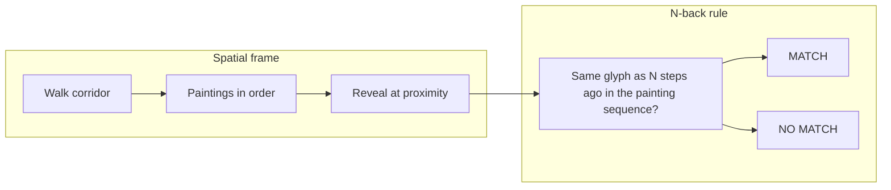
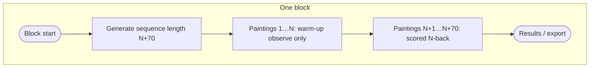
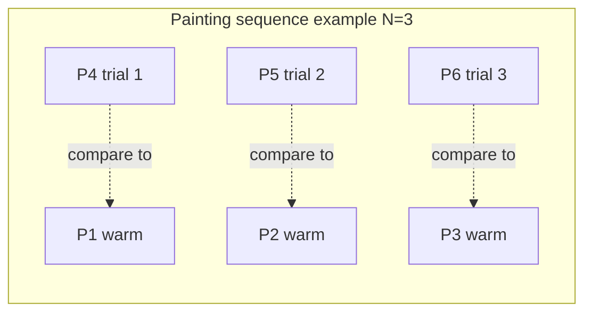
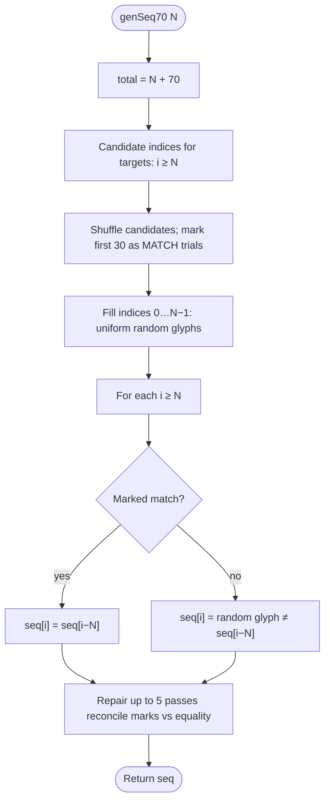
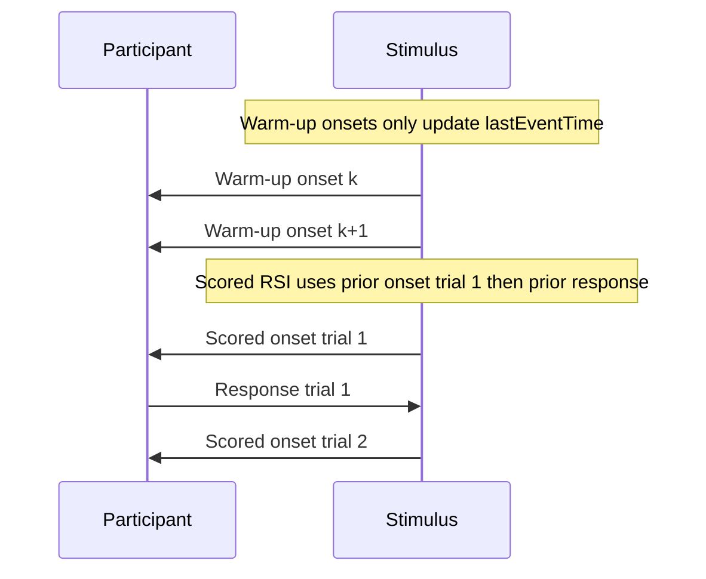
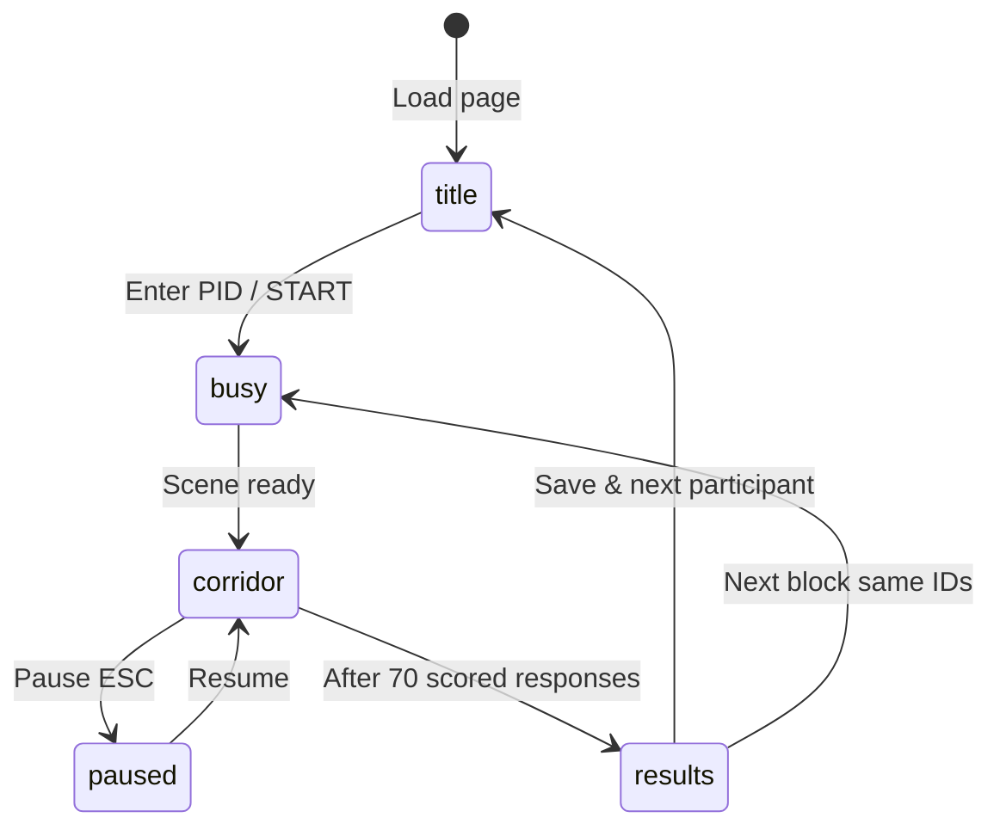

# GLYPHMIND

**GLYPHMIND** is a browser-based **first-person corridor** experiment framed as a **spatial visual N-back**. Participants walk an Egyptian-themed hallway; glyphs appear **one per painting**, **in visit order**. After **N** observe-only warm-up paintings, each further revelation is a **scored trial**: decide whether the current glyph **matches the glyph from exactly N paintings back** along the sequence.

This repository ships a **fully offline** runtime: open **`index.html`** with **`lib/`** (Three.js r128, SheetJS) and **`fonts/`** (UI fonts + Noto Egyptian Hieroglyphs). No build tools or network connection required at runtime.

---

## Table of contents

1. [Concept overview](#1-concept-overview)
2. [Game mechanics](#2-game-mechanics)
3. [Sequence generation](#3-sequence-generation-fixed-load-design)
4. [Trial timeline, timing, and export variables](#4-trial-timeline-timing-and-export-variables)
5. [Participant workflow](#5-participant-workflow-high-level)
6. [Research session workflow](#6-research-session-workflow-multi-block--multi-participant)
7. [Controls](#7-controls)
8. [Stimulus set](#8-stimulus-set)
9. [Data export briefly](#9-data-export-briefly)
10. [Technology](#10-technology)
11. [Running locally](#11-running-locally)
12. [License](#12-license)

---

## 1. Concept overview



| Layer | What it does |
|--------|----------------|
| **Presentation** | WebGL corridor (Three.js). Player moves and looks in first person; each wall panel can reveal **one** hieroglyph when approached. |
| **Memory demand** | Classic **N-back** discrimination on **discrete serial positions** (painting order), not continuous motor tracking. “Spatial” refers to **moving through space to reveal the next item**, not to judging location-in-the-room. |
| **Structure** | Per block: **N** warm-up paintings (no key response) → **70** scored trials with mandatory **MATCH / NO MATCH** responses. |

Design constants in code: **`TOTAL_TRIALS = 70`**, **`MATCH_COUNT = 30`** (30 targets, 40 non-targets among scored trials).

---

## 2. Game mechanics

### 2.1 Warm-up vs scored

Paintings are indexed **0 … N + 69** (zero-based internally). The participant advances **in corridor order** (same order as indices).

| Segment | Painting indices | Behaviour |
|---------|------------------|-----------|
| **Warm-up** | `0` … `N − 1` | Glyph reveals; **no match/no-match response**. Prompt reminds participant to observe and remember. Each revelation is logged as **`trialType = warmup`** (no ACC/RT). |
| **Scored** | `N` … `N + 69` | Each revelation is **one scored trial** (`trial 1` … `trial 70` in export). Participant must respond **MATCH** or **NO MATCH** before continuing the sequence conceptually; responses drive feedback and logging. |



### 2.2 N-back rule (scored trials only)

For painting index **i ≥ N**:

- **Current stimulus:** glyph at sequence position **i**.
- **Comparison stimulus:** glyph at position **i − N** (the glyph from **N paintings earlier** in the **same** walked order).

**MATCH (target trial)** if those two glyphs are **identical**.  
**NO MATCH** if they differ.

Example (**3-back**): warm-up uses paintings **1-3**. First scored trial is painting **4**; compare its glyph to painting **1**. Painting **5** compares to painting **2**, and so on.



### 2.3 Responses and coding

| Participant action | Code internally | Typical bindings |
|--------------------|-----------------|------------------|
| **MATCH** | `Resp = 1` | **F**, **Space**, **left click** |
| **NO MATCH** | `Resp = 2` | **J**, **right click** |

Correct answer (**CRESP**) follows ground truth:

| Ground truth | `tc` | `CRESP` |
|--------------|------|---------|
| Target (match trial) | `1` | `1` (MATCH) |
| Non-target | `2` | `2` (NO MATCH) |

**Accuracy (`ACC`)** is `1` when **`Resp === CRESP`**, else `0`.

Touch UI exposes dedicated **MATCH** / **NO MATCH** controls plus movement (joystick) and look (drag).

---

## 3. Sequence generation (fixed load design)

Each block calls **`genSeq70(N)`**, which builds one sequence of length **`N + 70`**.



Properties:

- **Exactly 30** scored positions (among **70**) are designated **matches**: current glyph equals glyph **N** steps back.
- **40** scored trials are **non-matches**: current glyph is drawn uniformly from glyphs **not equal** to **seq[i−N]**.
- Warm-up positions **`0 … N − 1`** are filled randomly (they establish context but **do not** enforce match/non-match structure relative to “prior N” in the same way as scored trials).
- A short **repair** loop reconciles accidental drift so labels stay consistent with the sequence.

---

## 4. Trial timeline, timing, and export variables

### 4.1 Stimulus onset and reaction time

When a painting **reveals** its glyph (`revealTime`):

- **Warm-up:** no response window; **`lastEventTime`** is updated to this **`revealTime`** (onset-to-onset spacing for the next RSI).
- **Scored:** **`awaitingResponse`** becomes true; **`RT`** (ms) is **`respTime − revealTime`** when the participant responds.

### 4.2 RSI and `rsiAnchor`

**RSI** in the spreadsheet is the **milliseconds from an anchor event to the next stimulus onset** (walk + approach latency included - this is **not** a blank ISI).

| Row type | `rsiAnchor` | Meaning |
|----------|-------------|---------|
| Warm-up, first painting | `none` | No prior anchor (RSI may be `0`). |
| Warm-up, later | `prior_stimulus_onset` | Time since previous warm-up onset. |
| Scored **trial 1** | `prior_stimulus_onset` | Time since last warm-up onset. |
| Scored **trials 2-70** | `prior_response` | Time since the **previous scored trial’s response**. |

Every exported row carries a numeric **`RSI`**; analysts should interpret it using **`rsiAnchor`**.



---

## 5. Participant workflow (high-level)



- **Title:** **Participant ID** is required; optional session metadata (**Session**, **Condition**, **Phase**, **N-back** preset).
- **Intro cutscene / tutorial:** Can be skipped depending on UI flow; instructions explain movement and match/no-match mapping.
- **Corridor:** Pointer lock on desktop after clicking the canvas (with UI hints). Participant approaches paintings in order; glyphs glow briefly after reveal.
- **Pause:** Pause menu can export, restart block, or return to title (with warnings if unexported data exists).
- **Results:** Accuracy summary; options for **next block** (same participant IDs, incremented **`block`** in export) or **save & next participant**.

Internal game phases include **`title`**, **`busy`**, **`corridor`**, **`paused`**, **`results`** (`RES.phase` stores experimental phase strings such as **`pre`**, **`during_stimulation`**, **`post`** - do not confuse the two).

---

## 6. Research session workflow (multi-block & multi-participant)

1. Set identifiers on the title screen; start the block.
2. Optionally run multiple blocks (**RUN NEXT BLOCK**) while keeping the same PID/session/condition/phase labels - the **`block`** column increments.
3. **Export** (`Export Data` or **`SAVE & NEXT PARTICIPANT`**) produces one **`.xlsx`** workbook (**Trials** + **Meta** sheets).

Detailed column order, multi-block examples, and workstation notes live in **[README_OFFLINE.md](./README_OFFLINE.md)**.

---

## 7. Controls

| Action | Desktop |
|--------|---------|
| Move | **W A S D** / arrows; **Shift** sprint |
| Look | Mouse (**pointer lock** after engaging canvas or hint) |
| MATCH | **F**, **Space**, **left click** |
| NO MATCH | **J**, **right click** |
| Pause | **Esc** |

**Touch:** on-screen joystick, drag-to-look, dedicated MATCH / NO MATCH buttons, pause control.

---

## 8. Stimulus set

The task uses **12** Unicode Egyptian Hieroglyphs from the [Egyptian Hieroglyphs](https://unicode.org/charts/PDF/U13000.pdf) block. In the app they are drawn with bundled **Noto Sans Egyptian Hieroglyphs**; below, symbols appear as Unicode characters (your viewer may fall back to another font).

| Symbol | Gardiner ID | Description | Codepoint |
|:------:|:-----------:|-------------|-----------|
| 𓂀 | **D010** | Eye (D10) | `U+13080` |
| 𓂋 | **D021** | Mouth (D21) | `U+1308B` |
| 𓂝 | **D036** | Hand (D36) | `U+1309D` |
| 𓅓 | **G017** | Owl (G17) | `U+13153` |
| 𓆄 | **H006** | Feather (H6) | `U+13184` |
| 𓆑 | **I009** | Horned viper (I9) | `U+13191` |
| 𓆓 | **I010** | Cobra (I10) | `U+13193` |
| 𓈖 | **N035** | Water (N35) | `U+13216` |
| 𓇼 | **N014** | Star (N14) | `U+131FC` |
| 𓏏 | **X001** | Loaf (X1) | `U+133CF` |
| 𓇳 | **N005** | Sun (N5) | `U+131F3` |
| 𓊽 | **R011** | Djed pillar (R11) | `U+132BD` |

Export columns **`Stimulus`** / **`Target`** use these Gardiner IDs; **`StimulusUnicode`** / **`TargetUnicode`** repeat the `U+…` codepoints; **`StimulusName`** / **`TargetName`** carry the descriptions above.
---

## 9. Data export (briefly)

Each scored row includes **`trialType = scored`**, **`trial` 1-70**, **`N`**, **`ACC`**, **`RT`**, **`RSI`**, **`rsiAnchor`**, stimulus/target metadata, and **`TriggerCondition` / `TriggerResponse`** codes.

Warm-up rows use **`trialType = warmup`**, populate **`warmupIndex`**, leave **`trial`** blank, and omit ACC/RT/response fields.

**Meta** sheet records timestamps (`sessionStartISO`, `exportedAt`), design constants (**70** trials, **30** targets per block), row counts, and short analyst notes (e.g. RSI semantics).

---

## 10. Technology

| Piece | Role |
|-------|------|
| **Three.js r128** (`lib/three.min.js`) | WebGL corridor, lighting, meshes |
| **SheetJS** (`lib/xlsx.full.min.js`) | Browser-side `.xlsx` export |
| **Web Audio API** | UI / feedback sounds |
| **Bundled fonts** (`fonts/`) | Cinzel family + hieroglyph coverage |

---

## 11. Running locally

1. Keep **`index.html`**, **`lib/`**, and **`fonts/`** in one folder (paths are relative).
2. Open **`index.html`** in a current **Chrome**, **Firefox**, **Safari**, or **Edge**.

If a locked-down machine blocks **`file://`** resources, serve the folder locally (still air-gapped):

```bash
python3 -m http.server 8080
# http://localhost:8080
```

---

## 12. License

Repository license is **not set** by default - add a **`LICENSE`** file before redistribution if you need explicit terms. Font attribution is summarized under **`fonts/FONT_NOTICE.txt`**.
